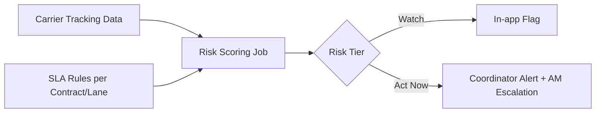

# PRD: Proactive SLA Breach Alerting for Logistics Ops

**Status:** Draft | **Owner:** [Your Name] | **Domain:** Supply Chain / Logistics SaaS

## 1. Problem

Logistics coordinators find out about an SLA breach the same way the customer does: a complaint. Most logistics platforms track shipment status and expected delivery windows, but they don't proactively surface "this shipment is trending toward a breach" — they only show a breach *after* it happens, when it's too late to intervene.

The result is a reactive operating model: ops teams are always explaining a miss after the fact instead of preventing it, and account managers get blindsided by customer escalations they had no early warning on.

## 2. Target user

- **Primary:** Logistics Coordinator / Ops Analyst — monitors active shipments, needs to intervene before a miss
- **Secondary:** Account Manager — needs advance notice to proactively communicate with the customer
- **Tertiary:** Ops Director — wants an aggregate view of SLA health, not shipment-by-shipment noise

## 3. Goals and success metrics

| Goal | Metric | Target |
|---|---|---|
| Catch at-risk shipments before breach | % of eventual breaches flagged >4 hrs in advance | >75% |
| Reduce reactive customer escalations | Inbound complaint volume tied to SLA misses | -40% |
| Keep signal-to-noise usable | False positive rate on "at risk" flags | <15% |

## 4. Non-goals

- Not a route optimization or carrier-selection tool — this is a monitoring/alerting layer, not a planning tool
- Not attempting to auto-resolve breaches (e.g., auto-rebooking carriers) in V1 — human-in-the-loop first, automation earned later
- Not building a customer-facing tracking page in V1 (internal ops tool first)

## 5. Key features (V1 scope)

1. **At-risk shipment scoring** — combines current transit status, distance/time remaining vs. SLA window, and carrier historical on-time rate for that lane
2. **Tiered alerting** — "Watch" (trending risky, no action needed yet) vs. "Act now" (intervention window closing), to avoid alert fatigue
3. **Lane-level SLA health view** — aggregate view for ops directors: which carrier/lane combos are chronically risky, not just individual shipment firefighting
4. **One-click escalation to account manager** — when a coordinator flags a shipment as "Act now," the account manager gets notified with context, not just a raw alert

## 6. Explicitly out of scope for V1

- Predictive weather/traffic integration (valuable, but a v2 add — start with data logistics platforms already have)
- Automated customer communication (risk of sending wrong/premature messaging before ops confirms the issue is real)

## 7. Key risks and open questions

- **Risk:** Alert fatigue is the single biggest failure mode for this category of tool. If "Watch" tier fires too often, coordinators will learn to ignore all alerts. Needs a conservative default threshold, tunable per lane.
- **Open question:** Should the risk score be a black-box probability or an explainable rule-based flag (e.g., "12 hrs behind expected pace for this lane")? Leaning explainable for V1 — ops teams need to trust and act on it immediately, not audit a model.
- **Risk:** Carrier data quality varies a lot (some carriers ping GPS every few minutes, others give daily manifest updates). The scoring model needs graceful degradation for low-frequency data sources, not a single assumption of real-time visibility.

## 8. Rough technical approach

- Ingest carrier tracking data (API where available, EDI/manifest parsing where not)
- Risk scoring as a near-real-time job (every 15-30 min), since intervention windows for logistics are often measured in hours, not days
- Alerting via existing ops tools (Slack/Teams webhook + in-app), not a new channel coordinators have to check separately

## 9. Why this matters (from experience)

The pattern I kept seeing in logistics ops: the data to predict a miss existed two or three checkpoints before the actual breach, but it lived in a status field nobody was actively watching. The product problem isn't "we lack data" — it's "we have data with no attention economy built around it." That's a much more common and more solvable problem than it first appears.
